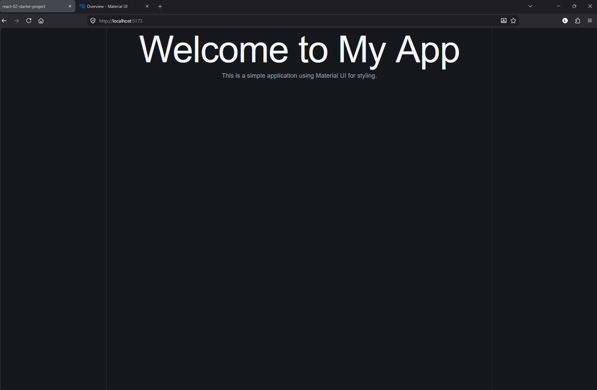

# Create Starter Project
This topic focuses on creating a blank starter project using Vite + React + JavaScript. Instead of cloning a ready-made project, you will follow step-by-step instructions to build your own setup, understand the default project structure, customize it, and run the development server. Finally, you will commit your starter project to GitHub for future reuse

## Topic

[x] [Create a new Starter Project](create-a-new-starter-project)

[x] [Project Structure](project-structure)

[x] [Styling your project](styling-your-project)

[x] [Clean up default Boilerplate](clean-up-default-boilerplate)

[x] [Practice commit the code](practice-commit-the-code)

## Create a new Starter Project
Create a new blank starter project. As introduced in react-01-get-start, this exercise encourages you to repeat the setup steps to build confidence. Some guided steps are included to reduce common errors, along with troubleshooting notes to support your learning. Over time, this will help strengthen your problem-solving skills.
Using commands is highly recommended to improve your understanding and confidence with the Command Line Interface (CLI) and Git Operation command

### For Windows user only
1. Open your VS Code editor. If it is not connected to the WSL environment, you can use several methods to establish the connection
- In VS Code, open the terminal panel by clicking on it or pressing Ctrl + , then run the following command: wsl
- Second method: Press Ctrl + Shift + P, type “WSL: Connect to WSL”, and press Enter
- Third method: Navigate to the bottom-left corner of the VS Code window, click “Open a Remote Window”, and select “Connect to WSL"
- Alternative method (Windows Terminal users) - Open Windows Terminal, run:

```bash
wsl
code .
```

### Mac or Linux users can start from here. Windows users should first connect to the WSL environment, then proceed from this step

2. Create project in a recommended directory
If you are a Linux user, managing and organizing directories is likely familiar to you. However, for Windows users using the WSL environment, we strongly recommend avoiding creating projects within the WSL-mounted Windows filesystem (e.g., /mnt/c, /mnt/d)

Many developers avoid working directly inside WSL-mounted Windows filesystem because of performace and compatiblility issues.

Commmon reason: 
- Slower file operations
- File permission differences
- File watching issues
- Git line-ending problems

> Note: This reflects my learning journey, where I encountered various issues that led to unexpected errors. Some frameworks or dependencies were not set up properly, making it difficult to manage and navigate my project files
>
> If you organize your projects properly in the recommended directory, you’ll find that the CLI becomes very convenient and powerful to use

```bash
# 1. navigate to /home or /home/<user-directory> is recommended
cd /home                # or
cd /home/laoniu         # laoniu - is my user directory

# 2. Create a new directory, E.g.: practice_react
# Take notes that in Linux environment is case sensitive
# In Windows GUI, normally we want to create a folder nest in root/ main folder
# Commonly, we preform this process right click -> Create folder -> Input name ->
# double click navigate to root/ main folder -> .......
# In Linux command line interface (CLI), I just need to execute this commmand
mkdir -p /home/laoniu/practice_react        # E.g.: my user directory name is laoniu. The new directory has created at /home/laoniu/

# verify my created directory
ls /home/laoniu                             # show practice_react

# if I want to navigate to the directory, instead of clicks ...... we execute this command
cd /home/laoniu/practice_react
```

3. Create a starter project with vite + React + JavaScript
```bash
# Let's show you with step-by-step method first
npx create-vite@latest <app-name>          # E.g.: replace the app-name to react-02-starter-project
```
Select 'React', and press ENTER
```
◆  Select a framework:
│  ○ Vanilla
│  ○ Vue
│  ● React
│  ○ Preact
│  ○ Lit
│  ○ Svelte
│  ○ Solid
│  ○ Ember
│  ○ Qwik
│  ○ Angular
│  ○ Marko
│  ○ Others
```
Select JavaScript, and press ENTER
```
◆  Select a variant:
│  ○ TypeScript
│  ○ TypeScript + React Compiler
│  ● JavaScript
│  ○ JavaScript + React Compiler
│  ○ RSC
│  ○ React Router v7 ↗ https://reactrouter.com
│  ○ TanStack Router ↗ https://tanstack.com/router
│  ○ RedwoodSDK ↗ https://rwsdk.com
│  ○ Vike ↗ https://vike.dev
```
Select 'Yes', and press ENTER
```
◆  Install with npm and start now?
│  ● Yes / ○ No
```
Then the new app will start to create and when complete ....
```
◇  Scaffolding project in /home/laoniu/practice_react/react-02-starter-project...
│
◇  Installing dependencies with npm...

added 135 packages, and audited 136 packages in 7s

31 packages are looking for funding
  run `npm fund` for details

found 0 vulnerabilities
│
◇  Starting dev server...

> react-starter-project@0.0.0 dev
> vite


  VITE v8.0.14  ready in 243 ms

  ➜  Local:   http://localhost:5173/               # press Ctrl + click to open the running app in browser
  ➜  Network: use --host to expose
  ➜  press h + enter to show help
```

Now let kill the run development server with press Ctrl + c to stop the running server
Then we remove the created app and use this quick command, see this magic !!!
```bash
# 1. Use the ls - a list command to verify the file exist existed
ls  ~/practice_react/                               # Return: react-starter-project

# 1. Remove the created app
rm -f -r ~/practice_react/react-02-starter-project/

# Then use the ls - a list command to verify the file has not existed
ls  ~/practice_react/                               # Return: react-starter-project disappeared
```

Now we using a single line command to create our starter porject
```bash
# Execute this command
npx create-vite@latest <app-name> --template react          # E.g.: replace the app-name to react-02-starter-project
```
Select 'Yes' and ENTER
```
│
◆  Install with npm and start now?
│  ● Yes / ○ No
```
The project has created
```
◇  Scaffolding project in /home/laoniu/practice_react/react-02-starter-project...
│
◇  Installing dependencies with npm...

added 135 packages, and audited 136 packages in 6s

31 packages are looking for funding
  run `npm fund` for details

found 0 vulnerabilities
│
◇  Starting dev server...

> react-starter-project@0.0.0 dev
> vite


  VITE v8.0.14  ready in 209 ms

  ➜  Local:   http://localhost:5173/               # press Ctrl + click to open the running app in browser
  ➜  Network: use --host to expose
  ➜  press h + enter to show help
```

---

## Project Structure
let’s walk through the project structure for each folder to gain a better understanding

```
<Project name>/
├── node_modules/               # Contains all installed dependencies (Do not commit to GitHub)
├── public/                     # Stored assets (images, video and etc...) are copied directly to the final build completely untouched
├── src/                        # The main application source code
│   ├── assets/                 # Stored assets (images, video and etc...) are actively compiled and minified by Vite
│   ├── App.css                 # Used to manage the global styles applied to app.jsx
│   ├── App.jsx                 # Main top-level React component. Usually contains: routing, layouts, global providers, app structure
│   ├── index.css               # Used to manage global reset styling
│   └── main.jsx                # Application entry point. Responsible for: creating React root, rendering App component, importing global CSS
├── .gitignore                  # Prevent local folders like node_modules and private .env secret keys from being uploaded to GitHub
├── eslint.config.js            # New file to replace .eslintrc.cjs, catches coding errors and enforces consistent code formatting rules across your project
├── index.html                  # Is the browser entry point of the app. It provides the HTML structure, metadata, scripts/styles, and the root element where React renders the application
├── package-lock.json           # locks the exact dependency versions used in the project to ensure consistent installations across different environments and developers
├── package.json                # Is the project's configuration hub, listing your project details, installed packages (dependencies), and custom terminal command scripts
├── README.md                   # Project's documentation file, written in Markdown, that explains what the application does, how to install it, and how to run it
└── vite.config.ts              # Is the main configuration file where you customize how Vite builds, bundles, and serves your project
```
---

## Styling your project
Learning how to style a project is a fundamental skill that every front-end developer must possess. Even though most modern companies have a dedicated UI/UX team to handle design layouts, developers are still responsible for turning those designs into clean, functional code

Anyone familiar with HTML knows that CSS (Cascading Style Sheets) is the core language used to style web interfaces. However, modern web development relies heavily on advanced styling frameworks and component libraries—such as Bootstrap, Tailwind CSS, and Material UI (MUI)—to build beautiful, responsive user interfaces efficiently

MUI is a widely used and powerful UI component library. In this learning path, we will use it as our core framework, but you are free to explore other libraries if you prefer [... Read more about MUI](https://mui.com/material-ui/getting-started/)

```bash
#  Install the core MUI packages
npm install @mui/material @emotion/react @emotion/styled
```
---

## Clean up default Boilerplate
In this section, you will create a blank project and clean up the default boilerplate

1. public - Delete the all the default assests in this directory
```bash
# Assume that you already at this ~/react-practice/react-02-starter-project
# If not, navigate to project directory. Example: cd ~/react-practice/react-02-create-starter-project
cd ~/<project root directory>/<project directory>       # <- Replace with correct directories

# Remove the assets in the public directory
rm public/*.*
```

2. src/assets - Delete the all the default assests in this directory
```bash
rm src/assets/*.*
```

3. Refactor App.jsx
Refactor App.jsx, import Material UI (MUI), and start using its UI components

```

# Remove all the code in the App.jsx
# Implement a clean startup code

import { Container, Typography } from '@mui/material'; // Import Container and Typography components from Material UI

function App() {
  return (
    <div>
      <Container maxWidth="xl">
        <Typography variant="h1" align="center">
          Welcome to My App
        </Typography>
        <Typography variant="h3" align="center">
          This is a simple application using Material UI for styling.
        </Typography>
      </Container>
    </div>
  );
}

export default App;

```

4. Remove the Global CSS line: import './index.css', and replace with the MUI CssBaseline
Origin
```
import { StrictMode } from 'react'
import { createRoot } from 'react-dom/client'
import './index.css'      // Remove this line this is a global css
import App from './App.jsx'

createRoot(document.getElementById('root')).render(
  <StrictMode>
    <App />
  </StrictMode>,
)
```

Replaced:
```
import { StrictMode } from 'react'
import { createRoot } from 'react-dom/client'
import CssBaseline from '@mui/material/CssBaseline'     // Replace with CssBaseline
import App from './App.jsx'

createRoot(document.getElementById('root')).render(
  <StrictMode>
    <App />
  </StrictMode>,
)
```

Before change the global ccs:



Before changed to CssBaseline:


5. Now you are safe to remove App.css
```bash
rm src/App.css
```
---

## Practice commit the code
Take this challenge to commit your code to GitHub

```bash
# 1. Go to GitHub, create a new repo

# 2. Link the server url
git remote add origin <github-ssh-url>

# 3. Check your server url, should be same as return git@........ (fetch)
git remote -v

# 4. Check status
git status

# 5. Stage your changes and check the status
git add .
git status

# 6. Commit changes
git commit -m 'Add your commit message'

# 7. Add git branch - main
git branch -M main

# 8. Check branch
git branch

# 9. Push code to remote repository with --set-upstream for the first commit
git push --set-upstream origin main
```